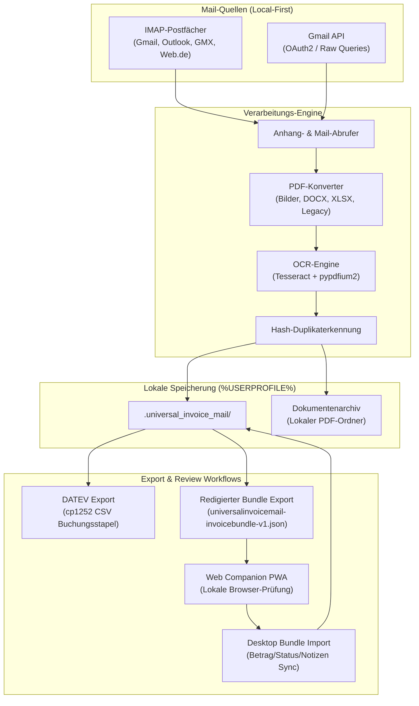

# UniversalInvoiceMail

[](https://github.com/doc-bricks)
[](https://github.com/open-bricks)
[](https://github.com/doc-bricks/UniversalInvoiceMail)
[](web_companion/)
[](https://www.python.org/)
[](#datenschutz)
[](llms.txt)
[](LICENSE)

Local-first Windows-Desktop-Tool zum Abrufen, Konvertieren und Archivieren von Rechnungen und Belegen aus E-Mails, inklusive privatem Rechnungsarchiv und DATEV-nahem CSV-Export.

**[English](README.md)** | **[Deutsch](README-DE.md)**

> [!NOTE]
> **KI / LLM-Integration:** Maschinenlesbarer Index und Architekturkontext sind unter [llms.txt](llms.txt) verfügbar.


## Systemarchitektur & Datenfluss



## Einstieg

| Bedarf | Einstieg |
|--------|----------|
| Rechnungen aus Mailkonten sammeln | IMAP- oder Gmail-API-Konto in der App einrichten |
| Belege von Shops oder Dienstleistern finden | Profilfilter für Absender, Betreff, Body-Text, Zeitraum und Gmail-Raw-Queries |
| Lokales Rechnungsarchiv pflegen | Zielordner im Windows-Benutzerprofil oder in einem lokalen Sync-Ordner |
| Buchhaltungsübergabe vorbereiten | Editierbare EUR-Beträge und DATEV-naher `cp1252`-CSV-Export |
| Portables Datenformat verstehen | [EXPORTFORMAT.md](EXPORTFORMAT.md) für das implementierte redigierte Austausch-Bundle |
| Redigiertes Bundle im Browser prüfen | `web_companion/` für lokale Rechnungsprüfung und Änderungsbundle-Export |

## Überblick

UniversalInvoiceMail verbindet klassische IMAP-Postfächer und optional die Gmail API mit einem lokalen PDF-Archiv-Workflow. Das Tool lädt Anhänge, rendert Bestellbestätigungen als PDF, erkennt Duplikate per Hash und speichert die Ergebnisse strukturiert pro Profil oder Shop.

## Funktionen

- Universal IMAP für Gmail, Outlook, GMX, Web.de, T-Online und weitere Provider
- Optionale Gmail-API-Anbindung für schnellere und robustere Gmail-Läufe
- Optionaler Gmail-Query-Builder pro Profil für Gmail API und Gmail-IMAP mit `X-GM-RAW`
- Profilbasierte Filter für Absender, Betreff, Body und Zeiträume
- Download von PDF-Anhängen sowie Konvertierung weiterer Anhangstypen nach PDF
- Unterstützte Konvertierung: Bilder (`.png`, `.jpg`, `.jpeg`, `.bmp`, `.tif`, `.tiff`, `.webp`), `.docx`, `.xlsx`
- Optionale Legacy-Konvertierung für `.doc` und `.xls` via Word/Excel-COM oder LibreOffice
- Optionales OCR für bildbasierte PDFs mit Tesseract und `pypdfium2`
- Editierbare Rechnungsbeträge direkt in der Tabelle für nachgelagerte Buchhaltung
- Optionaler DATEV-Export mit konfigurierbarer Berater-/Mandantennummer und Konten-Mapping im SKR03-Stil
- DATEV-Einstellungsdialog mit editierbarer Mapping-Tabelle, Hinzufügen/Entfernen,
  Standard-Wiederherstellung und persistierter Konfiguration
- Redigierter Export/Reimport von `universalinvoicemail-invoicebundle-v1.json` für Companion- und Prüf-Workflows
- Statischer `web_companion/` als PWA für lokale Bundle-Prüfung, Betrags-/Status-/Notiznachtrag, Änderungsbundle-Export und committed Install-Icons/Manifest
- Hash-basierte Duplikat-Erkennung über lokale Archivordner
- Sichere Passwortspeicherung via `keyring`

## Schnellstart

### Windows

1. `start.bat` ausführen
2. Mailkonto anlegen
3. Profil oder Shop-Vorlage einrichten
4. Zeitraum und Zielordner wählen
5. „Rechnungen abrufen“ starten

### Manuell

```bash
pip install -r requirements.txt
python UniversalInvoiceMail.py
```

## Typischer Workflow

1. IMAP- oder Gmail-API-Konto hinzufügen
2. Suchprofil mit Absender- oder Betreff-Filtern anlegen
3. Optional OCR und PDF-Modus aktivieren
4. Scan starten
5. Rechnungsbeträge eintragen für Belege, die in die Buchhaltung sollen
6. Ergebnisse im lokalen Archiv prüfen, als DATEV CSV exportieren oder als redigiertes Bundle weitergeben

## Lokale Datenhaltung

Laufzeitdaten liegen unter `%USERPROFILE%\.universal_invoice_mail\`:

```text
%USERPROFILE%\.universal_invoice_mail\
├── config.json
├── invoices.json
├── credentials.json
└── token.json
```

Das Standard-Archiv wird unter `%USERPROFILE%\Documents\Rechnungen\` angelegt.

## Optionale Komponenten

- Gmail API: `google-api-python-client`, `google-auth`, `google-auth-oauthlib`
- OCR: `pytesseract`, `pypdfium2`, `pypdf`, Tesseract OCR
- Legacy-Office: `pywin32` oder ein lokales LibreOffice mit `soffice.exe`
- DATEV-Export nutzt den integrierten `datev_exporter.py` und schreibt `cp1252`-CSV-Dateien

Fehlen OCR- oder Office-Pakete, überspringt die App nicht unterstützte Schritte sauber und protokolliert dies im Log.

## Buchhaltungs-Export

- Die Rechnungstabelle bietet eine editierbare Betragsspalte in EUR.
- `DATEV exportieren` erzeugt DATEV-Buchungsstapel für die selektierten Rechnungen.
- `berater_nr` und `mandant_nr` sind im Exportdialog einstellbar.
- Der DATEV-Einstellungsdialog unterstützt editierbare Absender-/Schlüsselwort-Mappings,
  Hinzufügen/Entfernen, Standard-Wiederherstellung und Speicherung über `DATEVConfig`.
- Der Dialog prüft vor dem Speichern Berater- und Mandantennummer, Sachkontenlänge,
  nicht leere numerische Konten-Zuordnungen sowie die von Groß-/Kleinschreibung
  unabhängige Eindeutigkeit der Absender-/Schlüsselwort-Schlüssel und nennt Fehler
  direkt. Die technische Prüfung ersetzt keine fachliche Kontierungsprüfung; der
  bestehende 93-Spalten-Exportvertrag bleibt unverändert.
- Rechnungen ohne eingetragenen Betrag werden bewusst übersprungen und danach ausgewiesen.
- `Bundle Export` schreibt ein redigiertes JSON-Bundle mit Profilfiltern, DATEV-Basisdaten, Rechnungs-Hashes und optionalen Dateireferenzen.
- `Bundle Import` akzeptiert aus einem Companion nur Betrag, Prüfflag und Notiz zurück und prüft vor dem Reimport ID und Datei-Hash.
- Der dependency-freie `web_companion/` öffnet dieses Bundle lokal im Browser und exportiert ein minimales Änderungsbundle für den Desktop-Importer.

## Suchkontext

UniversalInvoiceMail passt zu Suchanfragen wie `lokales Rechnungsarchiv aus E-Mails`, `Gmail Rechnungen herunterladen`, `IMAP Belege extrahieren`, `DATEV CSV Export aus E-Mails`, `PySide6 Rechnungsmanager`, `OCR Rechnungsanhänge archivieren` und `privacy-first Buchhaltungsworkflow`. Das Projekt ist keine gehostete Rechnungsplattform, keine Mail-Marketing-Automation und keine Cloud-Buchhaltung; Zugangsdaten, Tokens, Archive und erzeugte CSV-Dateien bleiben standardmäßig lokal im Windows-Profil.

## Tests

```bash
PYTHONIOENCODING=utf-8 python -m pytest -q
QT_QPA_PLATFORM=offscreen python tests/source_platform_smoke.py
npm --prefix web_companion test
```

Vorhanden sind gemockte Python-Tests für Hilfsfunktionen, IMAP-/Gmail-Workflows, DATEV-nahe Abläufe, Bundle-Export/-Import, Metadaten-Parität und Barrierefreiheits-Metadaten sowie Node-Contract-Tests für den Web Companion.

Plan-D-Readback vom 2026-08-16: `120/120` Pytest-Tests, Source-Platform-Smoke und
`compileall` waren grün. Die getrackte Web-Companion-Baseline bleibt bei `10/10`
Node-Tests; eine fremde, uncommittete Manifest-Variante liefert `9/10` und wurde
nicht übernommen. Die Android-/iOS-Geräte- bzw. Emulator-Abnahme bleibt separat offen.

## Datenschutz

- Zugangsdaten und Gmail-OAuth-Tokens werden unter `%USERPROFILE%\.universal_invoice_mail\` gespeichert, nicht im Repository.
- `.gitignore` schließt `credentials.json`, `client_secret*.json`, `token.json`, lokale Datenbanken, Beispielausgaben und portable OCR-Bundles aus.
- Echte Rechnungen, Anhänge und erzeugte Release-Artefakte bleiben lokal.

## Ökosystem & Geschwisterwerkzeuge

Teil der [doc-bricks](https://github.com/doc-bricks) Dokumenten-Produktivitäts-Suite und des [open-bricks](https://github.com/open-bricks) Dachs:

| Werkzeug | Ökosystem | Beschreibung |
|----------|-----------|--------------|
| [MailProcessor](https://github.com/doc-bricks/MailProcessor) | doc-bricks | System-Tray-Launcher und Orchestrator für alle Universal Mail Tools |
| [UniversalMailCleaner](https://github.com/doc-bricks/UniversalMailCleaner) | doc-bricks | Regelbasierter IMAP- und Gmail-Cleaner mit Safe-Trash-Modus |
| [UniversalDocsGrabber](https://github.com/doc-bricks/UniversalDocsGrabber) | doc-bricks | Dokumente und Anhänge automatisiert aus IMAP-Mails herunterladen |
| [DokuZen](https://github.com/doc-bricks/DokuZen) | doc-bricks | Minimalistischer Markdown-Dokumentenbetrachter und strukturierter Reader |
| [PDFtoPDFocr](https://github.com/doc-bricks/PDFtoPDFocr) | doc-bricks | Präzise OCR-Textebene für gescannte PDF-Dokumente |
| [DokuReader](https://github.com/doc-bricks/DokuReader) | doc-bricks | Offline-Dokumentenbetrachter und Indexer für strukturierte Archive |
| [MediaBrain](https://github.com/file-bricks/MediaBrain) | file-bricks | Lokale KI-gestützte Medien-Kategorisierung und Verschlagwortung |
| [TextBrain](https://github.com/file-bricks/TextBrain) | file-bricks | Semantische Textsuche und lokale Dokumenten-Extraktion |
| [ProFiler](https://github.com/file-bricks/ProFiler) | file-bricks | Erweiterte Datei-Organisation und regelbasierte Massen-Umbenennung |
| [DevCenter](https://github.com/dev-bricks/DevCenter) | dev-bricks | Entwickler-Cockpit und Repository-Telemetrie-Hub |
| [CodeBox](https://github.com/dev-bricks/CodeBox) | dev-bricks | Wiederverwendbare Code-Snippet-Ablage mit semantischer Suche |

## Lizenz

[MIT](LICENSE)

Drittanbieter-Laufzeitinventar: [THIRD_PARTY_LICENSES.txt](THIRD_PARTY_LICENSES.txt)
