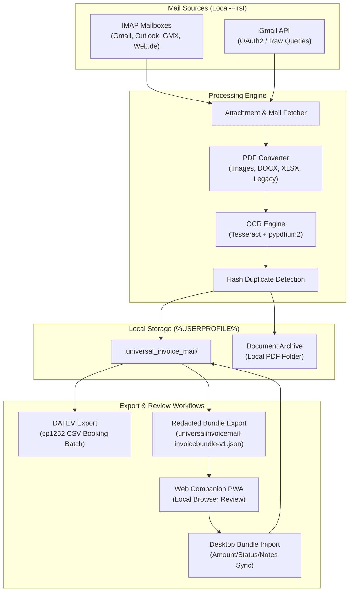

# UniversalInvoiceMail

[](https://github.com/doc-bricks)
[](https://github.com/open-bricks)
[](https://github.com/doc-bricks/UniversalInvoiceMail)
[](web_companion/)
[](https://www.python.org/)
[](#privacy)
[](llms.txt)
[](LICENSE)

Local-first Windows desktop tool for collecting invoices and receipts from email accounts, converting attachments to PDF, keeping a private archive, and preparing DATEV-style CSV exports.

**[English](README.md)** | **[Deutsch](README-DE.md)**

> [!NOTE]
> **AI / LLM Discovery:** Machine-readable index and architecture context are available in [llms.txt](llms.txt).


## System Architecture & Data Flow



## Start Here

| Need | Start with |
|------|------------|
| Collect invoices from mailboxes | IMAP or Gmail API account setup in the app |
| Find receipts from shops or providers | Profile filters for sender, subject, body text, dates, and Gmail raw queries |
| Keep a local invoice archive | Target folders under your Windows user profile or a local sync folder |
| Prepare accounting handoff | Editable EUR amounts and DATEV-style cp1252 CSV export |
| Understand portable data | [EXPORTFORMAT.md](EXPORTFORMAT.md) for the implemented redacted exchange bundle |
| Review a redacted bundle in a browser | `web_companion/` for local-only invoice checks and change export |

## Features

- Universal IMAP for Gmail, Outlook, GMX, Web.de, T-Online, and other providers
- Optional Gmail API integration for faster and more robust Gmail runs
- Optional per-profile Gmail query builder for Gmail API and Gmail IMAP with `X-GM-RAW`
- Profile-based filters for sender, subject, body, and date ranges
- Downloads PDF attachments and converts other attachment types to PDF
- Supported conversions: images (`.png`, `.jpg`, `.jpeg`, `.bmp`, `.tif`, `.tiff`, `.webp`), `.docx`, `.xlsx`
- Optional legacy conversion for `.doc` and `.xls` via Word/Excel-COM or LibreOffice
- Optional OCR for image-based PDFs (Tesseract + `pypdfium2`)
- Manual invoice amount column plus DATEV export for selected invoices
- DATEV settings mapping table with add/remove/reset controls and persisted configuration
- Redacted `universalinvoicemail-invoicebundle-v1.json` export/import for companion review workflows
- Static `web_companion/` PWA for local redacted bundle review, amount/status/notes edits, change-bundle export, and committed install icons/manifest
- Hash-based duplicate detection across local archive folders
- Secure credential storage via `keyring`

## Quick Start

### Windows

1. Run `start.bat`
2. Add a mail account
3. Configure a profile or shop template
4. Set date range and target folder
5. Click "Fetch Invoices"

### Manual

```bash
pip install -r requirements.txt
python UniversalInvoiceMail.py
```

## Typical Workflow

1. Add an IMAP or Gmail API account
2. Configure a search profile with filters and target folder
3. Optionally enable OCR and PDF mode
4. Start a scan
5. Enter invoice amounts for entries that should flow into accounting
6. Review results in the local invoice archive, export them as DATEV CSV, or hand off a redacted bundle

## Local Data

Runtime data is stored in `%USERPROFILE%\.universal_invoice_mail\`:

```text
%USERPROFILE%\.universal_invoice_mail\
├── config.json
├── invoices.json
├── credentials.json
└── token.json
```

Archived files are written to `%USERPROFILE%\Documents\Rechnungen\` by default.

## Optional Components

- Gmail API: `google-api-python-client`, `google-auth`, `google-auth-oauthlib`
- OCR: `pytesseract`, `pypdfium2`, `pypdf`, Tesseract OCR
- Legacy Office: `pywin32` or a local LibreOffice with `soffice.exe`
- DATEV export uses the bundled `datev_exporter.py` and writes cp1252 CSV files

When no OCR or Office backend is available, unsupported steps are logged and skipped; the run remains robust.

## Accounting Export

- The invoice table exposes an editable amount column in EUR.
- `DATEV exportieren` creates DATEV booking batches from the selected invoices.
- `berater_nr` and `mandant_nr` are configurable in the export dialog.
- The DATEV settings dialog supports editable sender/keyword mappings, row add/remove,
  default reset, and persistence through `DATEVConfig`.
- The settings dialog validates adviser and client numbers, account length, non-empty
  numeric account mappings, and case-insensitive uniqueness of sender/keyword keys before
  saving, and reports errors directly. This technical check does not replace an accountant's
  review of the account assignment; the existing 93-column export contract is unchanged.
- Invoices without an entered amount are skipped deliberately and called out after export.
- `Bundle Export` writes a redacted JSON bundle with profile filters, DATEV base data, invoice hashes, and optional file references.
- `Bundle Import` accepts only amount, review status, and notes back from a companion, guarded by invoice ID and file hash checks.
- The dependency-free `web_companion/` opens the redacted bundle locally in a browser and exports a minimal change bundle for the desktop importer.

## Search Context

UniversalInvoiceMail is intended for searches such as `local invoice email archive`, `Gmail invoice downloader`, `IMAP receipt extractor`, `DATEV CSV export from email`, `PySide6 invoice manager`, `OCR invoice attachment archive`, and `privacy-first accounting document workflow`. It is unrelated to hosted invoice platforms, mailbox marketing automation, or cloud bookkeeping suites; the default workflow keeps credentials, tokens, archives, and generated CSV files local to the Windows profile.

## Tests

```bash
PYTHONIOENCODING=utf-8 python -m pytest -q
QT_QPA_PLATFORM=offscreen python tests/source_platform_smoke.py
npm --prefix web_companion test
```

The repository includes mocked Python tests for helper functions, IMAP/Gmail workflows, DATEV-adjacent behavior, bundle export/import, compact UI control accessibility, metadata parity, plus Node contract tests for the Web Companion.

Plan-D readback on 2026-08-16: 120/120 Pytest tests, source-platform smoke, and
`compileall` passed. The tracked Web Companion baseline is 10/10 Node tests; a
pre-existing uncommitted foreign manifest variant is 9/10 and was not adopted.
Android/iOS device or emulator sign-off remains a separate open task.

For Linux, an additional headless smoke covers the desktop start path, missing-keyring handling, LibreOffice fallback detection and CSV export without requiring a visible session.

## Privacy

- Credentials and Gmail OAuth tokens are stored under `%USERPROFILE%\.universal_invoice_mail\`, not in the repository.
- `.gitignore` excludes `credentials.json`, `client_secret*.json`, `token.json`, local databases, sample output folders, and portable OCR bundles.
- Real invoices, attachments, and generated release artifacts should remain local.

## Ecosystem & Sibling Tools

Part of the [doc-bricks](https://github.com/doc-bricks) document productivity suite and the [open-bricks](https://github.com/open-bricks) umbrella:

| Tool | Ecosystem | Description |
|------|-----------|-------------|
| [MailProcessor](https://github.com/doc-bricks/MailProcessor) | doc-bricks | System tray launcher and orchestrator for Universal Mail Tools |
| [UniversalMailCleaner](https://github.com/doc-bricks/UniversalMailCleaner) | doc-bricks | Rule-based IMAP and Gmail mailbox cleaner with safe trash mode |
| [UniversalDocsGrabber](https://github.com/doc-bricks/UniversalDocsGrabber) | doc-bricks | Download documents and attachments from IMAP mail |
| [DokuZen](https://github.com/doc-bricks/DokuZen) | doc-bricks | Minimalist markdown document viewer and structured reader |
| [PDFtoPDFocr](https://github.com/doc-bricks/PDFtoPDFocr) | doc-bricks | High-fidelity OCR text layer generator for scanned PDFs |
| [DokuReader](https://github.com/doc-bricks/DokuReader) | doc-bricks | Offline document reader and indexer for structured archives |
| [MediaBrain](https://github.com/file-bricks/MediaBrain) | file-bricks | Local-first AI-assisted media categorization and tagger |
| [TextBrain](https://github.com/file-bricks/TextBrain) | file-bricks | Intelligent semantic text search and local document extraction |
| [ProFiler](https://github.com/file-bricks/ProFiler) | file-bricks | Advanced batch file organizer and rule-based rename engine |
| [DevCenter](https://github.com/dev-bricks/DevCenter) | dev-bricks | Developer cockpit and repository telemetry hub |
| [CodeBox](https://github.com/dev-bricks/CodeBox) | dev-bricks | Reusable code snippet repository with semantic lookup |

## License

[MIT](LICENSE)

Third-party runtime inventory: [THIRD_PARTY_LICENSES.txt](THIRD_PARTY_LICENSES.txt)
